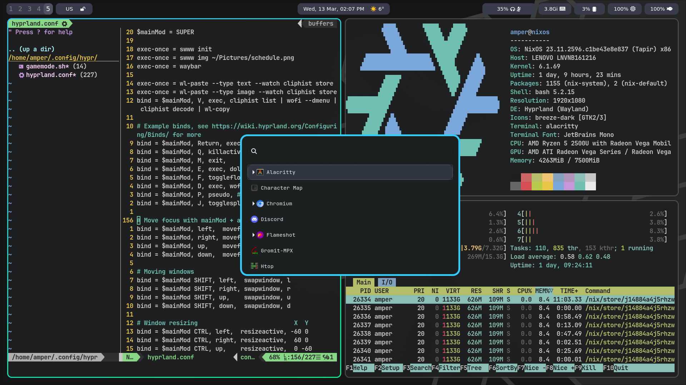

# Hyprland rice 

My hyprland configuration files + waybar, wofi and alacritty.



## Installation

Don't worry, this script will create reserve copy of your old configuration files for alacritty, hyprland, wofi and waybar!
```bash
./install.sh
```
